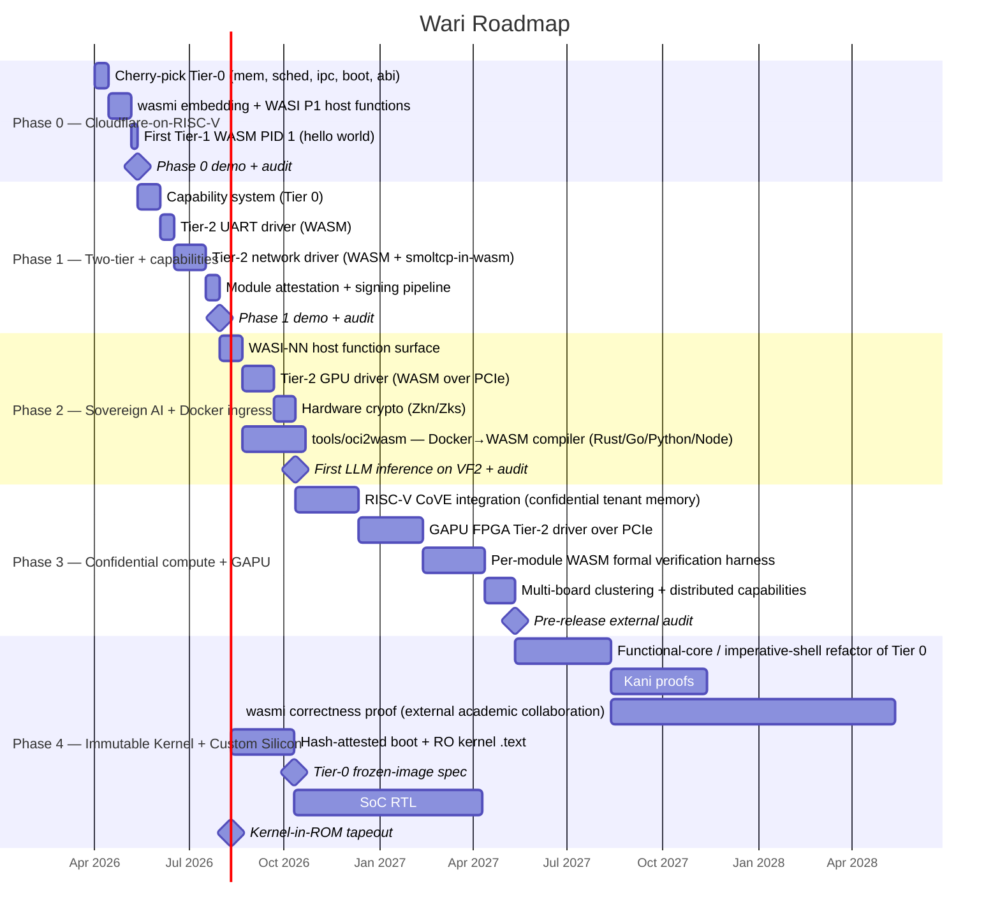

# CLAUDE.md — Wari

> \*\*Mission:\*\* A world-class, formally-verifiable, WASM-native operating
> system for RISC-V targeting sovereign cloud infrastructure in Latin
> America. Every decision optimizes for \*\*correctness, security, and size\*\*
> — in that order, and before convenience.


\---

## Project Identity

|Field|Value|
|-|-|
|**Name**|Wari|
|**Etymology**|Wari Empire (600–1000 CE, Andes). Administrative-first, quipu-information, infrastructure that outlasted its builders into the Inca era.|
|**Backronym**|**W**asm-native · **A**utonomous · **R**ust + **R**ISC-V · **I**solation-first|
|**Architect**|Gustavo Delgadillo|
|**Target HW (Phase 0)**|StarFive VisionFive 2 — JH7110, 4× U74 RV64GC|
|**Target HW (Phase 3)**|Multi-board RISC-V + GAPU FPGA coprocessor via PCIe|
|**Language**|Rust stable, `no\_std`. No C except verified OpenSBI shims inherited from upstream.|
|**Process model**|WASM-only (two tiers). No ELF in the customer-facing ABI ever.|
|**Runtime**|`wasmi` (no\_std pure interpreter). JIT deferred to Phase 2+.|
|**Boot chain**|OpenSBI (M) → U-Boot → Wari (S)|
|**License**|TBD before first external release|
|**Predecessor**|`goose-os` — separate repo at `https://github.com/westerngazoo/goose-os`. Reference only. Wari is WASM-native from boot zero, not a goose-os fork.|

\---


Check graphify before submitting anything

---


Co-Architect Protocol
---

**Gustavo is the architect. Claude is a technical collaborator.**

1. **Gustavo has final authority on every technical decision.** No
architectural choice, library pick, module boundary, feature
inclusion, naming, or implementation strategy lands without his
explicit approval.
2. **Every engineering decision is discussed before execution.**
Claude proposes options with trade-offs. Gustavo picks. Then
Claude executes.
3. **No silent structural changes.** Refactors, renames, dependency
additions, feature flag changes, and module moves require the same
discussion protocol as new features.
4. **Ambiguity resolves by asking, not assuming.** When a spec is
unclear, Claude stops and asks. A wrong guess that compiles is
still a wrong guess.
5. **Tactical cleanup during a task is allowed** — renaming a local
variable, splitting an over-long function, adding a missing doc
comment. Structural changes are not tactical.
6. **Claude surfaces disagreement in writing.** When Claude thinks
Gustavo's instruction is technically wrong, Claude says so with
reasoning before executing. Gustavo may overrule; Claude complies.

\---

## Build pipeline — NEVER `cd kernel && cargo build` alone

The kernel `include_bytes!`s pre-built, signed Tier-2 driver wasm
blobs (`build/drivers/net-{qemu,vf2}.signed.wasm`). Those wasm blobs
are produced from `drivers/net/src/` — a **separate cargo crate**
targeting `wasm32-unknown-unknown`. If you bypass `make` and run
`cd kernel && cargo build` directly after editing driver source,
cargo will happily embed the **last-known-good** driver blob,
which may be many builds stale.

This bit us in builds 107..114: a RISC-V `core::arch::asm!("fence
ow,ow")` I added to driver code broke the wasm32 build, and cargo
silently reused the build-106 artifact while the kernel banner read
"build 114". Every diagnostic added to the driver during that window
was a no-op because the kernel wasn't running our updated code.

**Always build via `make`:**

```bash
make kernel-vf2     # rebuilds drivers/net wasm32 → signs → links kernel
make build          # same flow for the QEMU variant
```

**Never run `cd kernel && cargo build` after touching driver code.**
The kernel's `build.rs` now contains a stale-driver guard that greps
the embedded signed wasm for a `WARI-DRV-BUILD-TAG-N` rodata string
and fails the build if `N != WARI_BUILD`. If that check ever fires,
run `make` and don't try to "fix" it by editing `build.rs`.

When adding new driver code, **double-check it compiles to wasm32**.
No inline asm. No RISC-V intrinsics. No `core::arch::asm!`. MMIO goes
through `wari_net_mmio_*` host fns; CPU-fence semantics come for free
when crossing the wasm→native boundary.

\---

## PR Workflow — The Review Loop

**No work lands on `main` without a PR review.** Every unit of work
flows: branch → local testing → push → PR → Gustavo reviews locally
→ Gustavo tests locally → Gustavo merges. Claude never merges.

### Branch naming

```
phase-<N>/<subsystem>-<kebab-case-summary>
```

Examples:

* `phase-0/kernel-cherry-pick-page-alloc`
* `phase-0/runtime-wasmi-embedding`
* `phase-1/drivers-uart-wasm-skeleton`
* `phase-1/cap-system-capability-table`

One branch per PR. Never stack unrelated work on one branch.

### PR size discipline

* **Preferred**: 100–400 changed lines. One conceptual change.
* **Acceptable**: up to \~800 lines if the change is genuinely atomic
(e.g. a full file cherry-pick with adapter edits).
* **Requires pre-approval**: anything larger. Claude must propose
the split before opening the PR.

A cherry-pick of a whole goose-os file counts as one conceptual
change even if the file is big.

### PR description template

Every PR body follows this template — **no exceptions**:

```markdown
## What

One-paragraph summary of the change. What does it add, modify, or
remove? Write it so Gustavo can skim the PR list and know what each
PR does without opening it.

## Why

What problem does this solve? Which roadmap phase and exit criterion
does it advance? Link to book chapter or architecture section if
applicable.

## How

2–5 bullets on the implementation approach. Mention the modules
touched. Call out any design trade-offs you made and why.

## Invariants affected

Which INV-N invariants from docs/invariants.md does this change
touch? If a new unsafe block is introduced, it MUST cite an
existing invariant or document a new one in the same PR.

## Security considerations

Mandatory section. Answer explicitly:
  - Does this add, widen, or narrow an attack surface? Where?
  - Is any new data flow crossing a trust boundary (Tier 1 ↔ Tier 2,
    Tier 2 ↔ Tier 0)? Which capability gates it?
  - Does it expose new host functions to Tier-1 WASM? Which ones,
    and how are they bounded?
  - What assumptions did you make about caller trust that the
    reviewer should verify?

If the answer to all four is "none," write "None — this PR is
purely internal to Tier 0 / pure logic / documentation."

## Tests

List the tests added or modified. Every PR that changes executable
behavior must add at least one test (unit, integration, security,
or fuzz). Documentation-only PRs are exempt.

  - Unit: <list>
  - Integration (QEMU): <list>
  - Security (adversarial): <list>
  - Fuzz: <list>

## Local verification

Paste the exact commands the reviewer should run and the expected
output. Gustavo runs these before merging.

## Out of scope

What this PR intentionally does not do. Prevents scope-creep
reviews and clarifies future work.

## Rollback

How to revert this change if it breaks main. Usually "`git revert`,"
but call out any migration or data-format change that makes revert
non-trivial.
```

### Review checklist (Gustavo runs through before merging)

* \[ ] All R1–R8 absolute rules hold
* \[ ] Every new `unsafe` cites an INV-N in a SAFETY comment
* \[ ] Public APIs have contracts (preconditions / postconditions / panics)
* \[ ] Tests present at the right layer
* \[ ] Why / How sections follow the depth rule (see `docs/pr-workflow.md` — full reasoning per non-obvious decision, not just what was picked)
* \[ ] Security considerations section is thoughtful, not copy-pasted
* \[ ] PR size is within discipline (or was pre-approved)
* \[ ] `cargo clippy -- -D warnings` clean
* \[ ] `cargo test` passes (host tests)
* \[ ] QEMU integration passes (if applicable)
* \[ ] `docs/invariants.md` updated if new unsafe landed
* \[ ] Local verification commands reproduce claimed output

### Merge strategy

**Squash merge.** The PR body becomes the commit message on main.
Keeps `main`'s history linear and readable. Build number bumps
happen in the squash-merge commit; branch-local commits are
scratch.

### Branch hygiene

* Delete branches after merge
* Don't rebase a published branch force-push unless Gustavo says so
* `main` is protected — direct pushes blocked

\---

## Testing Strategy — From Day One

Test coverage grows **with** the code, not after it. Every phase
milestone has test gates that must pass before the milestone is
considered done.

### The four test layers

|Layer|Tool|Runs on|Gate|
|-|-|-|-|
|**Unit**|`cargo test` (host)|Pure-logic modules|Every PR|
|**Integration**|QEMU `virt` RV64|Full kernel boot + WASM execution|Every PR that touches kernel or runtime|
|**Security (adversarial)**|WASM modules designed to fail|QEMU|Every PR that touches trust boundary|
|**Fuzz**|cargo-fuzz + wasmi's validator|Host|Periodic (weekly) + pre-release|

### Unit-testable modules (the pure-logic discipline)

These modules MUST remain host-testable (no `unsafe`, no MMIO, no
`static mut`):

* `abi-shared/` — syscall numbers, error codes, opcode tables
* `kernel/src/mem/page\_table.rs` — Sv39 walker, PTE encoding
* `kernel/src/mem/page\_alloc.rs` — bitmap allocator logic
* `kernel/src/validate.rs` — pure argument validators
* `kernel/src/cap/` — capability table mechanics (when introduced)
* `kernel/src/ipc.rs` — rendezvous state machine (mostly pure)

If a "pure" module grows `unsafe` or MMIO, it gets split — the
pure core stays host-testable, the impure glue moves to an
adjacent file with an `\_impl.rs` or `\_glue.rs` suffix.

### Integration test harness

`tests/integration/` contains harness code that:

1. Builds the kernel + a specific WASM test module
2. Boots QEMU with deterministic timing
3. Captures UART output
4. Asserts expected markers (PASS / FAIL / specific output)

Every integration test is a self-contained binary:

```
tests/integration/
├── boot\_smoke.rs          — kernel boots, banner prints, halts
├── hello\_wasm.rs          — Tier-1 WASM prints "Hello from Wari"
├── exit\_reaping.rs        — proc\_exit path, scheduler reaps cleanly
├── ipc\_rendezvous.rs      — two Tier-1 WASMs exchange a message
└── preempt.rs             — timer-driven preemption observable
```

### Security test suite — adversarial from the start

`tests/security/` holds WASM modules and kernel configurations
**designed to fail safely**. Every trust boundary gets at least one
adversarial test the moment the boundary exists.

Inherited from goose-os's security-test tradition, Wari-native tests:

```
tests/security/
├── malformed\_wasm.rs      — malformed bytecode → rejected at load
├── oom\_bomb.rs            — module tries to grow memory past limit
├── host\_fn\_escape.rs      — invalid args to a WASI host fn → error
├── cap\_forgery.rs         — Tier-1 tries to use an unowned capability
├── tier\_crossing.rs       — Tier-1 tries to call a Tier-2-only host fn
├── fuel\_exhaustion.rs     — infinite loop hits fuel limit, terminates
├── mmio\_bypass.rs         — Tier-1 attempts direct MMIO (must trap)
├── page\_fault\_kill.rs     — Tier-1 touches kernel VA → killed cleanly
└── kernel\_panic\_absence.rs — none of the above causes a kernel panic
```

**Rule**: a new trust-boundary-crossing feature cannot merge until
its adversarial test file exists and the corresponding malicious
input fails safely. "We'll add tests in a follow-up" is not
acceptable for security tests.

### Fuzz harness

`tests/fuzz/` uses `cargo-fuzz` for:

* WASM validator fuzz (via wasmi's own harness when possible)
* ABI decoder fuzz (random syscall numbers + arg patterns)
* Capability token fuzz (random cap indices under load)
* Page table walker fuzz (random VAs against arbitrary trees)

Fuzz runs are not part of every-PR CI (too slow). They run on:

* Every phase milestone (blocking)
* Weekly scheduled run
* Before any external release

### Security audit cadence

Separate from the per-PR security considerations, formal audit
points are scheduled into the roadmap:

|Milestone|Audit scope|
|-|-|
|**End of Phase 0**|Full invariant catalog review. Adversarial coverage for all Tier-1 host functions. Fuzz clean for 24h.|
|**End of Phase 1**|Capability system formal review. Threat model v2. External review invited.|
|**End of Phase 2**|Crypto integration audit. Side-channel analysis. Hardware attestation chain review.|
|**End of Phase 3**|Pre-release audit by external security firm. Formal-methods coverage report.|

Every audit produces a dated document in `docs/audits/` with:
findings, severity, remediation plan, and sign-off.

### What "test coverage" means here

Not a line-coverage percentage. That metric rewards testing easy
code. Wari's coverage standard is:

1. **Every invariant has at least one test** that would fail if
the invariant were violated.
2. **Every syscall has at least one negative test** that verifies
a malformed call returns a proper error, not a panic.
3. **Every trust boundary has at least one adversarial test** that
verifies the boundary holds under attack.
4. **Every public API has a doctest** that demonstrates correct
usage and at least one rejection case.

Line coverage is a side effect, not a target.

\---

## Code Quality Standards

Four engineering principles — **Think Before Coding**, **Simplicity First**,
**Surgical Changes**, **Goal-Driven Execution** — govern how every line
is written. Full text in [`docs/engineering-principles.md`](docs/engineering-principles.md).
Cite them by number in PR bodies when they apply.

The six per-module rules below sit on top of those four principles:

1. **No duplicated code.** DRY applies everywhere except where an
explicit comment documents the reason for duplication.
2. **Design patterns over clever code.** Prefer typed state machines,
trait-based extension points, and composition over macros, inline
cleverness, and ad-hoc control flow.
3. **Clean code as formalization staging.** Every module should read
as if Kani or Prusti will prove its invariants next quarter —
because eventually one of them will. This means: no magic numbers,
named constants for every threshold, explicit invariants in doc
comments, small pure functions, separation of policy from mechanism.
4. **Every abstraction pays for itself.** A trait with one impl is
debt. A function extracted for "future reuse" that never gets
reused is debt. Add indirection when a second caller appears.
5. **One concern per file.** Every file has a one-sentence purpose
in its module docstring. If you cannot write that sentence, the
file needs to be split.
6. **Pure before impure.** Separate pure logic (no unsafe, no MMIO,
no statics) into files that compile and test on the host. Impure
glue goes in adjacent files with explicit `// unsafe glue` banners.
7. **Cite prior art.** When adopting a pattern, cite the source in
the doc comment. When deliberately departing from an industry norm,
explain why. "We invented this" is rarely the right sentence — see
`docs/prior-art.md` for what we're building on.

\---

## Absolute Rules — Non-Negotiable

### R1. Every `unsafe` block carries a proof comment citing an invariant

Every `unsafe` block must have a `// SAFETY:` comment citing which
invariant in `docs/invariants.md` makes the operation sound.

```rust
// SAFETY: INV-1 (single-hart). PROCS is scheduler-owned and the
// scheduler only runs in trap context with interrupts disabled.
unsafe { PROCS\[pid].state = ProcessState::Ready; }
```

No exceptions. No "trust me." New invariants get a new INV-N entry
in the same PR that introduces the unsafe block.

### R2. No heap allocation in interrupt or dispatch context

Interrupt handlers, trap dispatch, scheduler code, and WASI host
functions never allocate. Pre-allocated buffers, ring buffers,
static slabs only.

### R3. MMIO only through typed volatile wrappers

Raw `ptr::read\_volatile`/`write\_volatile` is banned outside
`wari/kernel/src/mmio/`. Everything above that uses `VolatilePtr<T>`
or device-specific typed register wrappers.

### R4. Every public API has a contract in doc comments

Preconditions, postconditions, panics, and errors — written as if
Prusti will check them next release.

### R5. No panics in kernel syscall paths

`unwrap()` and `expect()` are banned in `wari/kernel/src/`. Every
fallible operation returns `Result<T, KernelError>`. Panics are
only acceptable as deliberate last-resort assertions (deadlock
discovery, invariant violation) with a justifying comment.

### R6. Memory barriers are explicit and documented

Every `fence`, `sfence.vma`, or `core::sync::atomic::fence` call
documents the ordering guarantee it provides and why.

### R7. No ELF in the customer ABI

Ever. There is no `SYS\_SPAWN\_ELF`. The kernel core is native Rust;
customer modules are WASM. Full stop.

### R8. Reproducible builds

`Cargo.lock` is committed. `rust-toolchain.toml` pins an exact
stable version. Build output is bitwise reproducible given the
same toolchain and source.

\---

## Architectural Invariant

**All code that runs on Wari is native kernel Rust (Tier 0) or WASM
(Tier 1 or Tier 2). There is no ELF executable path. Privilege level
is a per-module capability, not a language boundary.**

### Two-Tier WASM Model

```
┌─────────────────────────────────────────────────────────────┐
│  Tier 1 — Customer WASM  (U-mode, double-sandboxed)         │
│   • WASM validator + MMU both enforce isolation             │
│   • Target: 10 000 – 50 000 instances per board             │
│   • Access: WASI host functions only                        │
│   • Cold start target: < 10 ms                              │
├─────────────────────────────────────────────────────────────┤
│  Tier 2 — System WASM  (S-mode, WASM-only sandbox)          │
│   • Drivers, system services                                │
│   • Signed + attested before load                           │
│   • \~10–50 modules per board                                │
│   • Direct MMIO and IRQ handling via capability grants      │
├─────────────────────────────────────────────────────────────┤
│  Tier 0 — Native Kernel  (S-mode Rust, minimal)             │
│   • boot · trap · MMU · scheduler · wasmi runtime           │
│   • \~5–10 KLOC, formal-verification target                  │
│   • No third-party code except `wasmi` itself               │
└─────────────────────────────────────────────────────────────┘
```

### Security Model (three layers, all must hold)

|Layer|Mechanism|Guarantees|
|-|-|-|
|**Structural**|WASM type system + validator|No module generates pointers outside its linear memory. Proven at load time.|
|**Hardware**|Sv39 MMU + (Phase 1) RISC-V PMP + (Phase 3) RISC-V CoVE|Tier 1 cannot access kernel or other-tenant memory. CoVE provides ciphertext RAM per tenant — kernel dumps leak nothing.|
|**Cryptographic**|(Phase 2) Zkn/Zks hardware crypto|Data at rest is AES-256-GCM. Inter-module comms are BLAKE3-authenticated.|

See `docs/security-model.md` for the full threat model.

### Long-term endpoint — the Immutable Kernel (Phase 4+)

The two-tier model with structural WASM isolation is architecturally
compatible with an **MMU-free custom SoC variant**. If `wasmi` and
Tier 0 are formally verified and the kernel is hash-attested ROM,
the MMU becomes defense-in-depth rather than the primary isolation
mechanism. We build toward this without locking ourselves into it:
Phase 0–3 keeps the MMU as the primary line; Phase 4 opens the option
of shipping a ROM-burned Tier-0 kernel on custom silicon that omits
paging hardware entirely.

Prior art: Singularity OS (Microsoft Research, 2003–08), Tock OS
(Stanford, production use), RedLeaf (UCI, SOSP '20). See
`docs/book/part-1-architecture/ch07-immutable-endpoint.md` for the
narrative derivation.

## Prior Art — What We Learn From

Wari is not a research project inventing from scratch. It stands on
specific, cited work:

|Pattern|Source|
|-|-|
|Capability system + synchronous IPC|seL4 (Heiser et al., 2009–)|
|WASM as the process boundary|Fastly Compute@Edge (2019–)|
|Shared-runtime density (not per-tenant processes)|Cloudflare Workers (Kenton Varda, 2017–)|
|Narrow-purpose Rust kernel scope|Firecracker (AWS, 2018–), Hubris (Oxide, 2021–)|
|Language-enforced domain isolation|RedLeaf (Narayanan et al., SOSP '20), Singularity (MSR)|
|HW/SW co-design for cloud infrastructure|AWS Nitro (2017–) — our analog is GAPU FPGA|
|Confidential computing at the hardware line|RISC-V CoVE (ratified 2024)|
|MMU-free language-enforced isolation|Singularity, Tock OS|

See `docs/prior-art.md` for the full survey, citations, and what we
explicitly **reject** (V8, OCI compatibility, syscall shims).

Every architectural decision in Wari either (a) inherits from one of
these with credit, (b) deliberately rejects one with justification,
or (c) is labeled as an original bet with explicit risk mitigation.
**No architectural decision is unexplained.**

\---

## Module Structure

```
wari/
├── CLAUDE.md                    ← this file
├── Cargo.toml                   ← workspace root
├── Cargo.lock                   ← committed (R8)
├── rust-toolchain.toml          ← pinned stable (R8)
│
├── kernel/                      ← Tier 0: native Rust kernel (no\_std)
│   └── src/
│       ├── main.rs              ← \_start handoff
│       ├── boot.rs              ← staged boot (pre/post per stage)
│       ├── abi.rs               ← re-export of abi-shared
│       ├── trap.rs              ← trap entry + dispatch table
│       ├── mem/                 ← pure page\_alloc, page\_table + kvm glue
│       ├── sched/               ← scheduler + process table
│       ├── ipc.rs               ← seL4-style rendezvous
│       ├── cap/                 ← capability system (Phase 1)
│       ├── mmio/                ← typed volatile wrappers (R3)
│       ├── runtime/             ← wasmi embedding + host fn dispatch
│       ├── validate.rs          ← pure argument validators
│       └── error.rs             ← KernelError taxonomy (R5)
│
├── abi-shared/                  ← crate shared between kernel and WASM tooling
│   └── src/lib.rs               ← ONE SOURCE OF TRUTH for syscall/opcode numbers
│
├── wasi/                        ← WASI surface definitions
│   └── src/
│       ├── preview1.rs          ← baseline WASI Preview 1 subset
│       └── wari\_ext.rs          ← Wari-WASI extensions
│
├── drivers/                     ← Tier 2: WASM drivers (built as .wasm)
│   ├── uart/                    ← Phase 1
│   ├── net/                     ← Phase 1
│   ├── gpu/                     ← Phase 2
│   └── gapu/                    ← Phase 3
│
├── apps/                        ← Tier 1: example customer WASM apps
│   └── hello/                   ← Phase 0 milestone
│
├── platform/vf2/                ← board-specific firmware blobs
│
├── scripts/                     ← device-side scripts
├── build/                       ← build outputs
│
├── tests/
│   ├── integration/             ← QEMU + WASM end-to-end
│   ├── security/                ← adversarial WASM modules
│   └── fuzz/                    ← cargo-fuzz targets
│
├── tools/
│   └── qemu-runner/             ← deterministic test-harness runner
│
└── docs/
    ├── architecture.md          ← living architecture doc
    ├── invariants.md            ← INV-N catalog
    ├── security-model.md        ← threat model
    ├── wasi-surface.md          ← Wari-WASI spec
    ├── testing.md               ← test strategy
    ├── pr-workflow.md           ← this doc's PR section, expanded
    ├── audits/                  ← dated audit reports
    └── book/                    ← "Wari — A Sovereign OS" (Volume 2)
```

\---

## Roadmap



### Phase 0 Exit Criteria (concrete, testable)

1. Wari boots on QEMU `virt` RV64 and VisionFive 2 to the wasmi runtime.
2. A signed `.wasm` module loaded at boot runs as Tier-1 PID 1.
3. Module prints `Hello from Wari` via WASI `fd\_write` → kernel UART.
4. Module calls `proc\_exit(0)`; scheduler reaps cleanly.
5. Native ELF load attempt via any syscall → kernel rejects (the ELF
code path does not exist in the ship kernel).
6. Measured: cold start < 50 ms; 2 concurrent instances < 20 MB RAM.
7. No `ptr::read\_volatile` outside `kernel/src/mmio/`.
8. `docs/invariants.md` lists every unsafe block in the kernel.
9. Security test suite covers: malformed WASM, OOM bomb, MMIO bypass,
kernel-VA read. All fail safely; no kernel panic.
10. Phase 0 audit document in `docs/audits/phase-0.md` with sign-off.

\---

## Current Status

**Phase 0 kickoff.** Fresh repository. Scaffold in place; implementation
pending. First work by the execution agent is to propose the lean
Phase 0 plan for Gustavo's approval.

**Lean Phase 0 goal**: one WASM module at boot, no scheduler, no IPC.
Kernel boots, enables Sv39 paging, starts wasmi, loads a signed
`.wasm` (built from `apps/hello/`), runs it to `proc\_exit(0)`, halts.
Multi-tenant scheduling + IPC arrive in Phase 1 with the capability
system.

**Cherry-pick discipline**: "build from scratch, copy only what makes
sense." The predecessor (goose-os) is reference material — study it,
copy pure-logic modules where their design survives Wari's constraints
(WASM-only, two-tier), rewrite everything shaped by the ELF/native-
process assumptions.

Likely pure-logic copies from goose-os: `page\_alloc.rs`, `page\_table.rs`,
the validator functions from `security.rs`, and the `INV-N` framework
from `docs/unsafe-audit.md`. Everything else is written for Wari
directly, not ported.

\---

## Development Environment

```toml
# rust-toolchain.toml
\[toolchain]
channel = "1.95.0"   # pinned stable (R8)
components = \["rust-src", "llvm-tools-preview", "rustfmt", "clippy"]
targets = \["riscv64gc-unknown-none-elf", "wasm32-unknown-unknown"]
```

**Required tools:**

```bash
qemu-system-riscv64 --version   # >= 8.0
openocd --version               # >= 0.12 (hardware debug)
riscv64-unknown-elf-gcc         # assembly verification
cargo install cargo-binutils
cargo install cargo-fuzz        # fuzz harness (tests/fuzz/)
cargo install kani-verifier     # formal verification (Phase 3)
wabt / wasm-tools               # .wat ↔ .wasm, validation
```

\---

## Philosophy

> "Make it correct. Make it secure. Make it small. In that order."
>
> (Performance comes from smallness.)

This is the kernel of sovereign infrastructure for Latin America. The
people who will depend on it — governments, hospitals, banks, citizens
— deserve code you would be proud to submit to the seL4 team for review.

Every line. Every commit. Every PR. Every time.

\---

*Last updated: Phase 0 kickoff, April 2026
Architect: Gustavo Delgadillo

. Think Before Coding*

*Don't assume. Don't hide confusion. Surface tradeoffs.*


*Before implementing:*


*State your assumptions explicitly. If uncertain, ask.*

*If multiple interpretations exist, present them - don't pick silently.*

*If a simpler approach exists, say so. Push back when warranted.*

*If something is unclear, stop. Name what's confusing. Ask.*

*2. Simplicity First*

*Minimum code that solves the problem. Nothing speculative.*


*No features beyond what was asked.*

*No abstractions for single-use code.*

*No "flexibility" or "configurability" that wasn't requested.*

*No error handling for impossible scenarios.*

*If you write 200 lines and it could be 50, rewrite it.*

*Ask yourself: "Would a senior engineer say this is overcomplicated?" If yes, simplify.*


*3. Surgical Changes*

*Touch only what you must. Clean up only your own mess.*


*When editing existing code:*


*Don't "improve" adjacent code, comments, or formatting.*

*Don't refactor things that aren't broken.*

*Match existing style, even if you'd do it differently.*

*If you notice unrelated dead code, mention it - don't delete it.*

*When your changes create orphans:*


*Remove imports/variables/functions that YOUR changes made unused.*

*Don't remove pre-existing dead code unless asked.*

*The test: Every changed line should trace directly to the user's request.*


*4. Goal-Driven Execution*

*Define success criteria. Loop until verified.*


*Transform tasks into verifiable goals:*


*"Add validation" → "Write tests for invalid inputs, then make them pass"*

*"Fix the bug" → "Write a test that reproduces it, then make it pass"*

*"Refactor X" → "Ensure tests pass before and after"*

*For multi-step tasks, state a brief plan:*


*1. \[Step] → verify: \[check]*

*2. \[Step] → verify: \[check]*

*3. \[Step] → verify: \[check]*


