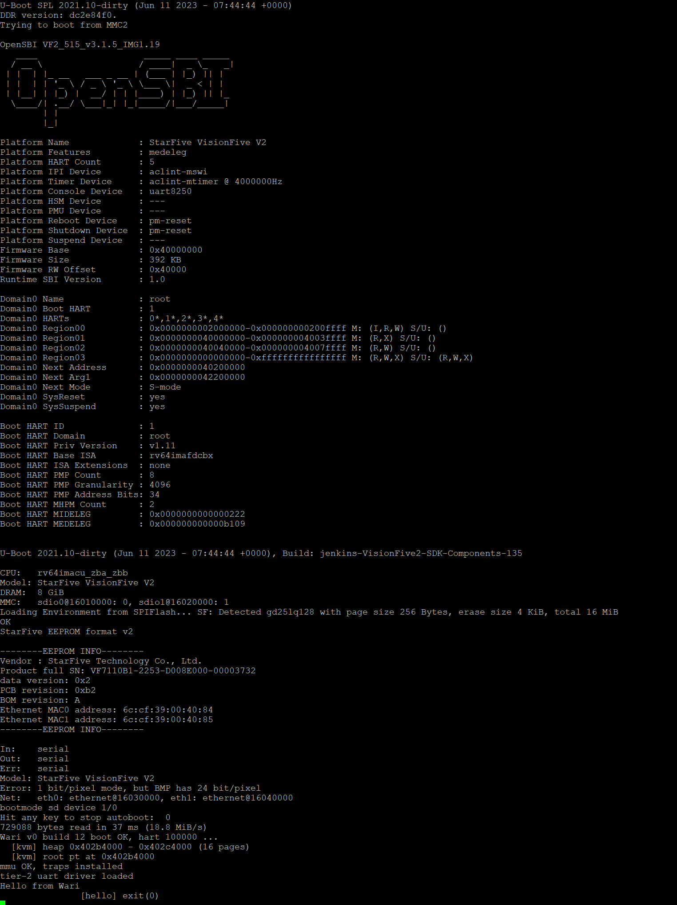

# A Statement from The Geese Collective

Cloud infrastructure is not abstract. It resides in specific
jurisdictions — Virginia, Dublin, Singapore — operated by a small
number of providers and governed by the laws of the countries that
host them. When a hospital in Oaxaca stores patient records, those
records sit on hardware it cannot inspect, in territory it does not
control, under legal frameworks its citizens did not shape. This is
not a peripheral technical concern. It is a question of digital
sovereignty.

The concentration of global compute and data services in the hands
of three providers has become a structural risk for the public
sector across the global south. Continuity of service, data
residency, lawful access, and supply-chain transparency all depend
on decisions made elsewhere. Latin American institutions deserve
infrastructure whose ownership, governance, and inspectability they
can verify directly.

Wari is one contribution to that goal: a WASM-native operating
system for RISC-V, released under AGPL-3.0, with no telemetry and
no undocumented interfaces. It is not a commercial product. It is a
shared engineering asset, intended to be adopted, audited, and
extended by the institutions that depend on it.

Built to be shared, not rented.

— The Geese Collective

---



*Wari v0 build 12, booting on a VisionFive 2 (JH7110, RISC-V RV64GC).
UART output over COM7. First "Hello from Wari" on real silicon —
April 2026.*

---

# Wari

A WASM-native operating system for RISC-V, designed for formal
verification and intended for sovereign cloud infrastructure in
Latin America.

**Status:** Phase 1a complete. Booting on VisionFive 2 silicon.
Phase 1b (capabilities, scheduler, IPC, and Tier-2 network driver)
in planning.

## Design principles

- **WASM-only process model.** No ELF in the client ABI, at any
  layer.
- **Two-tier sandbox.** Client code (Tier 1, MMU + WASM) and drivers
  (Tier 2, WASM-only) are both WASM modules, executed at distinct
  privilege levels through capability grants.
- **Minimal native kernel.** Tier 0 is approximately 5–10 KLOC of
  Rust, sized for formal verification.
- **Sovereign technology stack.** Open hardware (RISC-V), open
  drivers (auditable `.wasm`), confidential computing (CoVE,
  Phase 3), and custom silicon (GAPU FPGA, Phase 3).

See `docs/book/` for the full design rationale (Volume 2 of
*The Goose Factor*).

## Running on VisionFive 2

Phase 1a closed with a working deployment harness for real RISC-V
silicon. The day-to-day workflow:

```bash
make deploy                  # dev machine: build wari.bin, push to GitHub
wari go                      # on the VF2: pull, copy to /boot/kernel.bin, reboot
```

Initial bringup (cloning the repository on the device and
installing the `wari` shell function) is documented in
[`docs/vf2-bringup.md`](docs/vf2-bringup.md). Boot output appears
on COM7 — see the document for the expected banner.

## Getting started

For contributors, recommended reading order:

1. `CLAUDE.md` — rules, invariants, phases
2. `docs/architecture.md` — current architecture
3. `docs/prior-art.md` — what we adopt and what we reject
4. `docs/invariants.md` — the `INV-N` catalogue
5. `docs/pr-workflow.md` — how to propose a change
6. `docs/testing.md` — test layers and adversarial coverage
7. `docs/security-model.md` — threat model
8. `docs/book/` — Wari, Volume 2

## License

AGPL-3.0-only. See [`LICENSE`](LICENSE).

Built to be shared, not rented.
