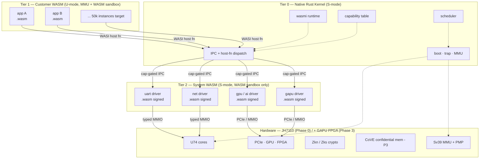
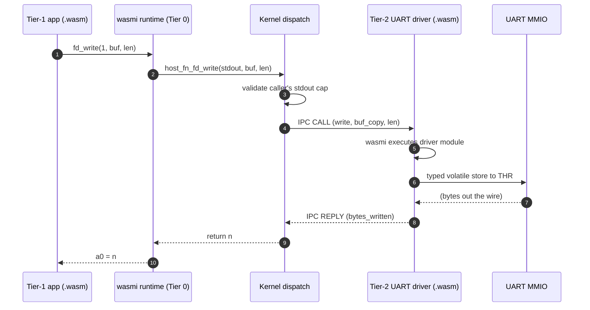

# Wari — Architecture (living document)

> **Scope**: the current architecture. Not the vision (see
> `book/part-1-architecture/` for that), not the roadmap (see
> `../CLAUDE.md` §Roadmap). Only what's true *right now*.

**Status**: Phase 1c — silicon bring-up. Phases 0/1a/1b shipped; the
Tier-2 network driver is in progress. Booting on QEMU `virt` and on the
StarFive VisionFive 2.

---

## Component overview

## Control flow — Tier-1 syscall

A Tier-1 app calls `fd_write(stdout, "Hello")`; this is the full path
through the system.

Two WASM sandbox crossings (Tier 1 → Tier 2), two kernel dispatches,
zero process-level context switches. Every crossing is capability-gated.

## Subsystem state

| Subsystem        | Status | Where                                                     |
|------------------|--------|-----------------------------------------------------------|
| Workspace layout | Done   | Cargo workspace                                           |
| ABI (syscalls/errors) | Done | `kernel/src/abi.rs`, `abi-shared/`                       |
| Tier 0 memory    | Done   | `kernel/src/mem/{kvm,page_alloc,page_table}.rs`           |
| Tier 0 scheduler | Done (Phase 1b) | `kernel/src/sched/`                              |
| Tier 0 IPC       | Done (Phase 1b) | Capability Endpoint/Notification objects — `kernel/src/cap/objects.rs` |
| Tier 0 trap      | Done   | `kernel/src/trap.rs`, `trap.S`                            |
| Typed MMIO (R3)  | Done   | `kernel/src/mmio/volatile.rs`                             |
| wasmi embedding  | Done   | `kernel/src/runtime/engine.rs` (wasmi 0.32.3)             |
| WASI host fns    | Done   | `kernel/src/runtime/{wasi,host_fns}.rs`                   |
| Tier 1 hello     | Done (Phase 1a) | `apps/hello/` — runs on VF2 silicon                |
| Capability system | Done (Phase 1b) | `kernel/src/cap/`                                |
| Tier-2 UART driver | Done | `drivers/uart/`, `kernel/src/runtime/tier2_uart.rs`       |
| Tier-2 net driver | In progress (Phase 1c) | `drivers/net/`, `kernel/src/runtime/tier2_net.rs` — GMAC0 + smoltcp wired, ARP/ICMP under calibration |

## Design decisions settled since Phase 0

1. **wasmi version + feature set.** Pinned to `wasmi` 0.32.3, `no_std`
   pure interpreter. JIT deferred to Phase 2+.
2. **`.wasm` signing + boot verification.** Tier-2 bytecode is ed25519
   signature-verified against the kernel's compiled-in pubkey before
   instantiation — `kernel/src/runtime/sign.rs` (INV-13).
3. **PID allocation.** PID 1 = first Tier-1, PID 2+ = Tier-1 pool,
   PIDs from 16 up are Tier-2 drivers.

See `book/part-1-architecture/` for the narrative derivation of this
architecture and why it looks like this.
