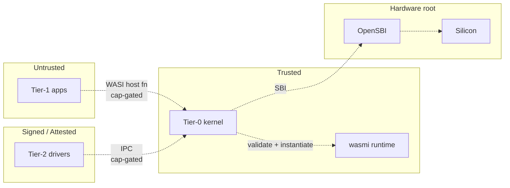

# Wari — Security Model

> Threat model, trust boundaries, defenses, and the assumptions under
> which those defenses hold. Updated every phase milestone.

---

## Layered defense — what holds today and what's on the roadmap

Wari's tenant-isolation story is a **stack of independently-broken-only
sandboxes**. Most single-mechanism failures don't break isolation. The
load-bearing exception is documented immediately below the table; this
is the section to read first if you are forming an opinion on how much
of the "defense in depth" claim is shipped vs. promised.

| Layer | Mechanism | Primary guarantee | Broken by | Status |
|---|---|---|---|---|
| **1. Structural** | WASM validator + type system (`wasmi`) | Tier-1 module cannot construct pointers outside its linear memory | Bug in `wasmi` validator OR a host-side soundness bug in the interpreter (see caveat below) | Phase 0 — **shipped** |
| **2. Hardware (Sv39 MMU)** | Separate page tables per Tier-1 instance | Tier-1 cannot read/write other-tenant or kernel memory through a *wasm-level* layer-1 escape (out-of-bounds linear-memory access, missing bounds check on a wasm op) | Kernel page-table management bug | Phase 0 — **shipped** |
| **3a. Hardware (PMP)** | RISC-V Physical Memory Protection | Redundant memory region enforcement independent of page tables | Bug in PMP setup | Phase 1 — **planned** |
| **3b. Cryptographic** | AES-256-GCM at-rest, BLAKE3 in-flight (Zkn/Zks hw) | Even if attacker exfiltrates raw memory or disk blocks, contents are ciphertext | Key-management compromise | Phase 2 — **planned** |
| **3c. Confidential compute** | RISC-V CoVE | Ciphertext RAM per tenant — kernel core-dump leaks nothing | Hardware side-channel; CoVE-silicon availability and correctness | Phase 3 — **planned, hardware-dependent** |

**Today (Phase 1c): two layers shipped, three on the roadmap.** A
sympathetic skim of this table can leave the impression that all five
layers are in production. They are not. Procurement-grade auditors and
investors should read "shipped" / "planned" columns literally before
forming an isolation claim.

### Load-bearing caveat — wasmi runs in S-mode

Layer 2 (the MMU) catches a Layer 1 escape *only* when the escape is a
**wasm-level** primitive — a Tier-1 module persuades the wasmi
interpreter to skip a linear-memory bounds check, then attempts a raw
pointer dereference. The MMU traps the dereference; the escape stops
there.

Layer 2 does **not** catch a **host-side soundness bug in wasmi
itself**. The wasmi interpreter executes in S-mode inside the kernel
address space; its `Store`, `Engine`, and per-instance state live in
kernel memory and are identity-mapped RW. A type-confusion or
out-of-bounds-write in wasmi's host-side Rust code corrupts kernel
state directly. From the page-table's perspective, wasmi *is* the
kernel: there is no privilege boundary between them to enforce.

For threats of this class — wasmi-soundness bugs, not wasm-runtime
escapes — Layers 1 and 2 collapse into one defense. The mitigation
roadmap is (a) continuous fuzzing of the kernel's pinned wasmi
version, (b) Phase 4 formal verification of wasmi's interpreter core
(speculative; depends on academic partner), (c) treating `wasmi` as
part of the Tier-0 TCB and counting its lines in the audit surface.

This caveat does not invalidate the layered model; it scopes it. The
common case (malformed wasm, OOB linear-memory access, missing trap
handler) is genuinely double-sandboxed. The rare case (wasmi
host-Rust memory-safety bug) is single-sandboxed today.

### Network attack surface — Tier-2 driver scope

A second important threat-model split lives in the network stack. The
Tier-2 net driver embeds `smoltcp` (~30 KLOC) in its WASM sandbox; the
cap layer mediates every socket op from Tier-1. See
[`net-driver-design.md`](net-driver-design.md) §"Why TCP/IP in Tier-2"
for the design choice. Two distinct threats, two distinct
containment stories:

- **Cross-tenant attack** (Tier-1 tenant A exploits a smoltcp bug
  reachable via the IPC socket-op surface to read or corrupt tenant
  B's traffic state). **Contained.** The cap system prevents tenant
  A from naming tenant B's socket caps; smoltcp's per-socket state
  is keyed off cap identity; the WASM sandbox prevents the driver
  itself from reaching kernel memory.
- **Remote attacker** (an attacker on the network sends a crafted
  packet that exploits smoltcp's *parser* — IP/TCP header handling
  before any per-tenant dispatch). **Not contained at the
  driver-blast-radius layer.** The board has one NIC, one net
  driver, one smoltcp instance; a parser-level exploit gives the
  attacker control of the driver's WASM linear memory, which holds
  every tenant's connection state. The cap system and the WASM
  sandbox still prevent the compromised driver from reaching kernel
  memory, but the blast radius inside the driver is *all network
  traffic for all tenants on this board* until the operator
  re-flashes a patched signed driver.

The right framing for procurement: Tier-2 isolation contains
*application-layer* TCP misuse but does not contain a *parser-layer*
smoltcp CVE the way a separate per-tenant network namespace would.
Mitigation: dedicated smoltcp fuzzing, fast operator patch cadence,
multi-NIC + per-NIC driver instantiation if/when the platform
supports it (Phase 2+ multi-board work).

**Rule**: a feature that crosses a trust boundary (adds a host fn,
adds a capability, widens driver MMIO surface) does not merge until
its effect on this section is updated — both the layer table and, if
relevant, the network attack-surface notes.

---

## Trust boundaries

- **Tier-1 → Tier-0**: widest surface, most critical. Every WASI host
  function is an attack vector. Audited host-fn-by-host-fn.
- **Tier-2 → Tier-0**: narrower; Tier-2 modules are signed + attested,
  but still sandboxed (they run inside wasmi). IPC is the only data
  path.
- **Tier-0 → Hardware**: trusted; the kernel is the silicon's peer.
- **Between Tier-1 instances**: zero direct path. Shared state only
  through Tier-0 (via IPC) or Tier-2 (via drivers).

---

## Threat model (Phase 0–1)

| Threat | Likelihood | Impact | Mitigation |
|---|---|---|---|
| Malicious customer WASM (wasm-level escape attempt) | High | Low (sandboxed) | Layer 1 + Layer 2 — fully double-sandboxed |
| `wasmi` validator bug (bytecode passes validator but is malformed) | Low | High | Layer 2 catches escapes that turn into raw-pointer dereferences + fuzz Tier-1 bytecode |
| `wasmi` host-side soundness bug (memory-safety bug in the interpreter's Rust) | Low | Critical | **Layer 2 does NOT catch this** — wasmi runs in S-mode kernel address space; see §"Load-bearing caveat" above. Mitigations: continuous wasmi fuzz, treat wasmi as TCB in audit, Phase 4 formal verification of interpreter core |
| Remote-attacker smoltcp parser exploit (net) | Low | High | Cap layer contains tenant→tenant escalation; **does NOT contain attacker→all-tenant-traffic** via the single shared driver instance. See §"Network attack surface" above; mitigations are smoltcp fuzz + fast patch cadence + multi-NIC partitioning when platform supports it |
| Resource exhaustion (fork-bomb analog) | Medium | Medium | Fuel metering (Phase 2) + hard per-module memory cap |
| Tier-2 driver compromise (driver wasm sandbox escape via wasmi bug) | Low | High | Signed loading; same wasmi-host-side caveat applies — Layer 2 does not contain a wasmi soundness bug in the driver runtime either |
| Kernel memory-safety bug | Low | Critical | Rust type system + INV-N audit + formal verif Phase 3+ |
| Hardware backdoor (x86-style ME) | None on RISC-V | N/A | ISA choice — open, auditable silicon |
| Data exfiltration from disk | Medium | High | Layer 3b (hw crypto, Phase 2) |
| Data exfil from memory dump | Medium | High | Layer 3c (CoVE, Phase 3) |
| Supply-chain attack | Medium | High | Reproducible builds (R8), pinned deps, single-source-of-truth ABI |
| Foreign legal access | Varies | Critical | LATAM jurisdiction; no US-controlled silicon |
| Physical tampering | Low | Critical | Phase 4 — hash-attested ROM kernel, burn-in SoC |

---

## Assumptions we explicitly depend on

1. **The Rust compiler's safety guarantees hold for `safe` code.**
   A Rust codegen bug would defeat us, like any Rust project. We
   mitigate by pinning the compiler version and waiting for CVE
   history to settle before upgrading.

2. **The `wasmi` validator AND interpreter host-side code are correct.**
   Our biggest single-point dependency, in two parts. (a) The
   *validator* rejects malformed wasm before instantiation; a
   validator bug that lets invalid bytecode through is partially
   contained by Layer 2 (the MMU traps the resulting raw-pointer
   dereference). (b) The *interpreter host-side Rust code* — `Store`,
   `Engine`, instruction-dispatch — runs in S-mode kernel address
   space; a memory-safety bug in this code is **not** contained by
   Layer 2 because there is no privilege boundary between wasmi and
   the rest of the kernel. Mitigations: continuous fuzzing of the
   pinned wasmi version (validator AND interpreter), counting wasmi
   in the Tier-0 TCB for audit purposes, Phase 4 formal verification
   of the interpreter core (depends on academic partner).

3. **RISC-V silicon implements Sv39 correctly.** We can't verify
   silicon; we bet on open hardware's auditability and the ecosystem
   catching bugs before they matter.

4. **OpenSBI is correct at its narrow interface.** We inherit this
   from the ecosystem. We don't extend SBI. Small surface.

---

## Audit cadence

| When | Scope | Output |
|---|---|---|
| **Per PR** | Security considerations section in PR body | Reviewer sign-off |
| **Phase 0 gate** | Every Tier-1 host fn; fuzz harness runs; invariant coverage | `docs/audits/phase-0.md` |
| **Phase 1 gate** | Capability system formal review; threat model v2 | `docs/audits/phase-1.md` |
| **Phase 2 gate** | Crypto integration; side-channel analysis | `docs/audits/phase-2.md` |
| **Phase 3 gate** | External security-firm audit; formal-methods coverage report | `docs/audits/phase-3.md` |
| **Phase 4 gate** | Pre-tapeout formal verification of kernel + wasmi | `docs/audits/phase-4.md` |

Each audit produces a dated document with: findings, severity,
remediation plan, sign-off.
