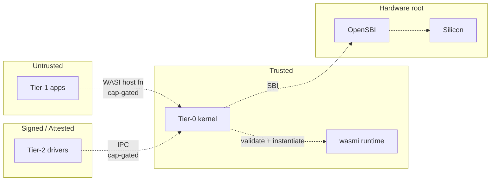

# Wari — Security Model

> Threat model, trust boundaries, defenses, and the assumptions under
> which those defenses hold. Updated every phase milestone.

---

## Layered defense — what holds today and what's on the roadmap

Wari's tenant-isolation *design* is a **stack of independently-broken-only
sandboxes**, where no single-mechanism failure breaks isolation. Today
only the first layer of that stack exists, so today a single-mechanism
failure does break it. The sections immediately below the table are
the ones to read first if you are forming an opinion on how much of
the "defense in depth" claim is shipped vs. promised.

| Layer | Mechanism | Primary guarantee | Broken by | Status |
|---|---|---|---|---|
| **1. Structural** | WASM validator + type system (`wasmi`) | Tier-1 module cannot construct pointers outside its linear memory | Bug in `wasmi` validator OR a host-side soundness bug in the interpreter (see caveat below) | Phase 0 — **shipped** |
| **2. Hardware (Sv39 MMU)** | Tier-1 in U-mode with separate page tables per instance | Tier-1 cannot read/write other-tenant or kernel memory through a *wasm-level* layer-1 escape (out-of-bounds linear-memory access, missing bounds check on a wasm op) | Kernel page-table management bug | **Not implemented** — planned (see §"What Layer 2 is today") |
| **3a. Hardware (PMP)** | RISC-V Physical Memory Protection | Redundant memory region enforcement independent of page tables | Bug in PMP setup | Phase 1 — **planned** |
| **3b. Cryptographic** | AES-256-GCM at-rest, BLAKE3 in-flight (Zkn/Zks hw) | Even if attacker exfiltrates raw memory or disk blocks, contents are ciphertext | Key-management compromise | Phase 2 — **planned** |
| **3c. Confidential compute** | RISC-V CoVE | Ciphertext RAM per tenant — kernel core-dump leaks nothing | Hardware side-channel; CoVE-silicon availability and correctness | Phase 3 — **planned, hardware-dependent** |

**Today: one layer shipped, four on the roadmap.** Tenant isolation
rests entirely on Layer 1. A sympathetic skim of this table can leave
the impression that several layers are in production. They are not.
Procurement-grade auditors and investors should read the "Status"
column literally before forming an isolation claim.

*Correction (2026-10-28): earlier revisions of this document listed
Layer 2 as shipped in Phase 0. It never was — see the next section.*

### What Layer 2 is today — one S-mode address space

There is no U-mode and no per-instance address space. Every trap
originates in S-mode (`kernel/src/trap.S` removed the U-mode entry
path); `satp` is written exactly once, at boot, with a single
identity-mapped RW kernel address space (`kernel/src/mem/kvm.rs`).
The wasmi interpreter, every Tier-1 instance's `Store` and linear
memory, every Tier-2 driver's linear memory, and the kernel's own
state all live in that one address space, all writable from S-mode.

Consequence: **Layer 1 is the only isolation mechanism.** Any Layer 1
escape is a full compromise, of other tenants and of the kernel:

- a `wasmi` validator bug that admits malformed bytecode;
- a missing or wrong bounds check in the interpreter;
- a host-side soundness bug in wasmi's own Rust (`Store`, `Engine`,
  instruction dispatch);
- a host-function bug in Tier 0 that trusts a guest-supplied
  offset or length.

None of these is caught by the MMU today. Mitigations in place:
wasmi's validator, typed host-fn argument validation, and counting
`wasmi` as part of the Tier-0 TCB for audit purposes. Mitigations on
the roadmap: continuous fuzzing of the pinned wasmi version, Layer 2
proper (below), and Phase 4 formal verification of wasmi's interpreter
core (speculative; depends on an academic partner).

**Designing Layer 2 is an open decision, not a mechanical task.**
Moving Tier-1 linear memory behind per-instance page tables catches
a *wasm-level* escape (an access the interpreter should have
bounds-checked) only if the access is made from a context that uses
those page tables. While the interpreter itself runs in S-mode in the
kernel address space, a host-side wasmi soundness bug stays
uncontained even with per-instance tables. Whether the interpreter
(or AOT-compiled code) runs in U-mode, and what that costs per
host-fn call, is the design question Layer 2 has to answer. Until it
does, native code produced by an AOT engine runs under the same
constraint: a compiler bug in it is a direct escape, with nothing
behind it.

**That question is now decided**: everything that is not Tier 0 —
the interpreter, compiled code and the Tier-2 drivers — moves to
U-mode, one address space per process
([ADR-004](adr/ADR-004-runtime-out-of-kernel.md)). Nothing in this
section changes until the steps of that ADR land; the table above
stays "not implemented" until then.

### Network attack surface — Tier-2 driver scope

A second important threat-model split lives in the network stack. The
Tier-2 net driver embeds `smoltcp` (~30 KLOC) in its WASM sandbox; the
cap layer mediates every socket op from Tier-1. See
[`net-driver-design.md`](net-driver-design.md) §"Why TCP/IP in Tier-2"
for the design choice. Two distinct threats, two distinct
containment stories:

- **Cross-tenant attack** (Tier-1 tenant A exploits a smoltcp bug
  reachable via the IPC socket-op surface to read or corrupt tenant
  B's traffic state). **Contained only while the driver is not
  compromised.** The cap system prevents tenant A from naming tenant
  B's socket caps, and smoltcp's per-socket state is keyed off cap
  identity. But a smoltcp bug that gives tenant A control of the
  driver lands in the same place as the remote case below,
  including the DMA path to kernel memory.
- **Remote attacker** (an attacker on the network sends a crafted
  packet that exploits smoltcp's *parser* — IP/TCP header handling
  before any per-tenant dispatch). **Not contained.** The board has
  one NIC, one net driver, one smoltcp instance; a parser-level
  exploit gives the attacker control of the driver's WASM linear
  memory, which holds every tenant's connection state, so the blast
  radius is at least *all network traffic for all tenants on this
  board*. It is in fact larger: the WASM sandbox stops the driver's
  loads and stores, but not the DMA it programs (next section). A
  compromised net driver can reach kernel memory.

The right framing for procurement: Tier-2 isolation contains
*application-layer* TCP misuse but does not contain a *parser-layer*
smoltcp CVE, neither at the network-namespace level nor, until the
DMA gap below is closed, at the kernel boundary. Mitigation: close
the DMA gap first; then dedicated smoltcp fuzzing, fast operator
patch cadence, multi-NIC + per-NIC driver instantiation if/when the
platform supports it (Phase 2+ multi-board work). The decision and
its order of work are in `adr/ADR-002-network-layering.md`: DMA
addressing moves into the kernel, then the stack leaves the driver
into a Tier-2 module with no device capability. The first half of
that step is in: on the VirtIO path the kernel writes every
descriptor address (`wari::nic_dma_set_buf`) and refuses driver
writes to the queue-address registers; the GMAC path follows in its
own PR (see INV-25's status note in `invariants.md`).

### DMA — the driver programs physical addresses

A Tier-2 driver's WASM sandbox bounds what the driver *loads and
stores*. It does not bound what the driver tells a bus-master device
to load and store, and the GMAC on the JH7110 sits behind no IOMMU.

INV-25 states that every span a DMA engine is told to touch lies
inside the driver's own linear memory. Until ADR-002 step 1 nothing
enforced it: the driver computed physical addresses from its
linear-memory base (`lin_mem_base`) and wrote them into descriptors in
its own memory and into the DMA list registers, and a driver that
wrote an arbitrary address got the device to read or write it —
kernel memory included. Signing (INV-11/INV-13) guarantees which
driver is loaded, not what it does after a smoltcp exploit takes it
over, and U-mode (ADR-004) does not help: a bus master does not go
through the MMU.

**It is now enforced on both NICs** — VirtIO on QEMU, and the DWMAC4
GMAC on the VF2 (in code; the silicon run is pending at the time of
writing). The descriptor tables live in kernel memory; the driver
cannot store to them. It asks
the kernel to aim a descriptor at a span of its own memory, and the
kernel checks the span and writes the whole descriptor — address,
length and direction. Validating only the address, or validating it
into a descriptor the driver can still write, is not containment: the
length next to it, and the address itself after the check, would
remain the driver's to change. The same holds for the registers
around the table: the queue size, selection and readiness registers
are the kernel's (a larger queue size would have the device read
kernel memory past the table as descriptors), and the driver may only
negotiate features that leave the ring layout as validated. On the
GMAC the same reasoning covers the ring length, the receive buffer
size and the descriptor skip and format bits, and two things specific
to this engine: it must not be started before the kernel has
programmed the lists (it would walk the reset value, address 0), nor
reset after (which clears them) — so the start bits are refused until
attach and the reset and clock/reset registers after it. A hardware
IOPMP/PMP fence is not available on the JH7110. What remains is
information, not control: the driver can read ring and buffer
registers back and so learn physical addresses (INV-25, "Not
covered").

**Rule**: a feature that crosses a trust boundary (adds a host fn,
adds a capability, widens driver MMIO surface) does not merge until
its effect on this section is updated — both the layer table and, if
relevant, the network attack-surface notes.

---

## Trust boundaries

```mermaid
graph LR
    subgraph UT[Untrusted]
        T1[Tier-1 apps]
    end
    subgraph Semi[Signed / Attested]
        T2[Tier-2 drivers]
    end
    subgraph T[Trusted]
        T0[Tier-0 kernel]
        Wasmi[wasmi runtime]
    end
    subgraph HW[Hardware root]
        Fw[OpenSBI]
        Sil[Silicon]
    end

    T1  -.->|WASI host fn<br/>cap-gated| T0
    T2  -.->|IPC<br/>cap-gated| T0
    T0  -.->|validate + instantiate| Wasmi
    T0  -.->|SBI| Fw
    Fw  -.-> Sil
```

- **Tier-1 → Tier-0**: widest surface, most critical. Every WASI host
  function is an attack vector. Audited host-fn-by-host-fn.
- **Tier-2 → Tier-0**: narrower; Tier-2 modules are signed + attested,
  but still sandboxed (they run inside wasmi). Their data paths into
  Tier 0 are cap-gated host functions (MMIO windows, `lin_mem_base`,
  `nic_attach_queue`, …) — and, for a driver of a bus-master device,
  the DMA it programs, which no host function mediates today (§"DMA").
- **Tier-0 → Hardware**: trusted; the kernel is the silicon's peer.
- **Between Tier-1 instances**: zero direct path while Layer 1 holds.
  Shared state only through Tier-0 (via IPC) or Tier-2 (via drivers).
  Nothing below Layer 1 separates them (§"What Layer 2 is today").

---

## Signing keys

INV-13 says the kernel runs a Tier-2 driver, or a module arriving at
runtime, only if its envelope is signed by the key the kernel was
built to accept. That guarantee is exactly as strong as the custody of
the secret key, so the model is stated here.

| Key | Public half | Secret half | Accepted by |
|-|-|-|-|
| **Production** | `scripts/prod-keys/wari-prod.ed25519.pub` (committed) | Held by the architect, outside every repository. Never in git, never in CI. | Kernels built **without** `dev-keys` — the default |
| **Dev** | `scripts/dev-keys/wari-dev.ed25519.pub` (committed) | `scripts/dev-keys/wari-dev.ed25519.sec` — committed, **public** | Kernels built with `--features dev-keys` only |

- **One key per image, never both.** The feature swaps the trust root
  instead of adding to it, so a production image rejects every
  dev-signed envelope with `BadWasm`.
- **A dev-keyed image is not a secure image.** Anyone can sign for it.
  It prints `!! DEV SIGNING KEY ACCEPTED - NOT FOR PRODUCTION` under
  the boot banner. It exists so QEMU, the test suites and a
  contributor's own board work from a clean checkout with no secret.
- **The dev secret stays committed and is not rotated.** It has been
  public since the first commit that carried it; a replacement in the
  same directory would be public too. The fix is that production does
  not trust it.
- **The kernel image is reproducible from source** (R8): the accepted
  public key is a tracked file. Reproducing the *signed driver blobs*
  of a production build needs the secret — ed25519 signing is
  deterministic, so its holder gets identical bytes.
- **Build wiring.** `scripts/build.sh` signs VF2 profiles with the
  file named by `WARI_SIGN_KEY` (default
  `~/.config/wari/wari-prod.ed25519.sec`) and stops if it is missing;
  `--dev-keys`, the `qemu` profile and every `make` target use the dev
  pair. `sign-module` refuses to sign unless the secret derives to the
  public key the target kernel accepts.
- **Verification is strict** (`verify_strict`): small-order keys and
  non-canonical signatures are rejected.

Adversarial test: `tests/security/tests/signing_key_custody.rs` boots
a production-keyed kernel carrying dev-signed drivers and requires the
load to be refused without a panic.

Not covered yet: revocation and rotation of the production key (a new
key means a new kernel image), and hardware custody (HSM or token).
Until the image itself is attested, whoever can replace the kernel on
the boot medium can replace the trust root with it.

## Threat model (Phase 0–1)

| Threat | Likelihood | Impact | Mitigation |
|---|---|---|---|
| Malicious customer WASM (wasm-level escape attempt) | High | Low while Layer 1 holds | Layer 1 only — single-sandboxed today; Layer 2 not implemented (see §"What Layer 2 is today") |
| `wasmi` validator bug (bytecode passes validator but is malformed) | Low | Critical | **Not contained today** — no MMU separation between tenants or from the kernel. Mitigations: fuzz Tier-1 bytecode; Layer 2 when it lands |
| `wasmi` host-side soundness bug (memory-safety bug in the interpreter's Rust) | Low | Critical | **Not contained** — wasmi runs in S-mode in the kernel address space, and would still with per-instance page tables unless the interpreter itself leaves S-mode; see §"What Layer 2 is today" above. Mitigations: continuous wasmi fuzz, treat wasmi as TCB in audit, Phase 4 formal verification of interpreter core |
| Remote-attacker smoltcp parser exploit (net) | Low | Critical | **Not contained**: reaches all tenants' traffic through the single shared driver instance, and kernel memory through driver-programmed DMA. See §"Network attack surface" and §"DMA" above; mitigations are kernel-owned DMA addressing (open), smoltcp fuzz, fast patch cadence, multi-NIC partitioning when the platform supports it |
| Resource exhaustion (fork-bomb analog, non-yielding loop) | Medium | High | **Partially mitigated** (ADR-002 step 4): Tier-1 instances run on a fuel-metered engine with a per-step budget (`wari_sched::TIER1_FUEL_PER_STEP`); a tenant that never yields is faulted when the budget runs out and the other tenants, the network poll and Ctrl-R keep running (`tests/security/tests/fuel_exhaustion.rs`, probe spawned at every boot). Not yet: Tier-2 driver budgets and watchdog, and a kernel-imposed per-module memory cap — linear memory is still bounded only by the module's own declared maximum and the kernel heap |
| Tier-2 driver compromise (wasmi bug, or a driver taken over through its own parser) | Low | Critical | Signed loading only. Not contained: the same single-address-space caveat applies, and a driver of a DMA-capable device can reach any physical address (§"DMA") |
| Kernel memory-safety bug | Low | Critical | Rust type system + INV-N audit + formal verif Phase 3+ |
| Hardware backdoor (x86-style ME) | None on RISC-V | N/A | ISA choice — open, auditable silicon |
| Data exfiltration from disk | Medium | High | Layer 3b (hw crypto, Phase 2) |
| Data exfil from memory dump | Medium | High | Layer 3c (CoVE, Phase 3) |
| Supply-chain attack | Medium | High | Reproducible builds (R8), pinned deps, single-source-of-truth ABI |
| Foreign legal access | Varies | Critical | LATAM jurisdiction; no US-controlled silicon |
| Physical tampering | Low | Critical | Phase 4 — hash-attested ROM kernel, burn-in SoC |

---

## Assumptions we explicitly depend on

1. **The Rust compiler's safety guarantees hold for `safe` code.**
   A Rust codegen bug would defeat us, like any Rust project. We
   mitigate by pinning the compiler version and waiting for CVE
   history to settle before upgrading.

2. **The `wasmi` validator AND interpreter host-side code are correct.**
   Our biggest single-point dependency, in two parts. (a) The
   *validator* rejects malformed wasm before instantiation; a
   validator bug that lets invalid bytecode through is **not**
   contained today (there is no Layer 2, see §"What Layer 2 is
   today"). (b) The *interpreter host-side Rust code* — `Store`,
   `Engine`, instruction-dispatch — runs in S-mode kernel address
   space; a memory-safety bug in this code is **not** contained by
   Layer 2 because there is no privilege boundary between wasmi and
   the rest of the kernel. Mitigations: continuous fuzzing of the
   pinned wasmi version (validator AND interpreter), counting wasmi
   in the Tier-0 TCB for audit purposes, Phase 4 formal verification
   of the interpreter core (depends on academic partner).

3. **RISC-V silicon implements Sv39 correctly.** We can't verify
   silicon; we bet on open hardware's auditability and the ecosystem
   catching bugs before they matter.

4. **OpenSBI is correct at its narrow interface.** We inherit this
   from the ecosystem. We don't extend SBI. Small surface.

---

## Audit cadence

| When | Scope | Output |
|---|---|---|
| **Per PR** | Security considerations section in PR body | Reviewer sign-off |
| **Phase 0 gate** | Every Tier-1 host fn; fuzz harness runs; invariant coverage | `docs/audits/phase-0.md` |
| **Phase 1 gate** | Capability system formal review; threat model v2 | `docs/audits/phase-1.md` |
| **Phase 2 gate** | Crypto integration; side-channel analysis | `docs/audits/phase-2.md` |
| **Phase 3 gate** | External security-firm audit; formal-methods coverage report | `docs/audits/phase-3.md` |
| **Phase 4 gate** | Pre-tapeout formal verification of kernel + wasmi | `docs/audits/phase-4.md` |

Each audit produces a dated document with: findings, severity,
remediation plan, sign-off.
